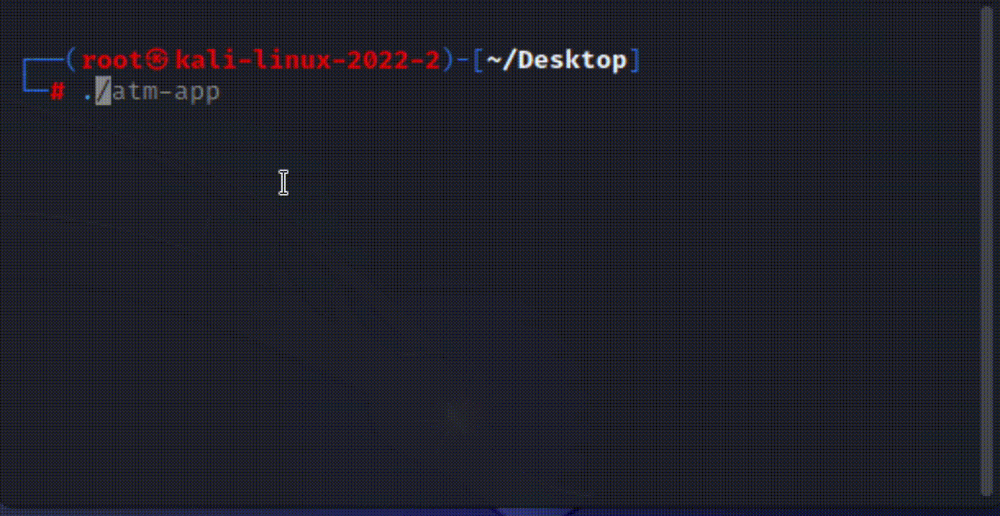

# BIN Patcher

BIN Patcher is a simple Rust-based program for patching BIN files.



## Description

The program allows altering data in a given file, writing bytes to a specified memory address, and supports ELF format.

## Installation

You can download the ready-to-use binary from the releases section, or compile the program yourself.

To compile, you will need [Rust](https://www.rust-lang.org/).

Clone the repository:

```
git clone https://github.com/BugsBound/bin_patcher.git
```

Change to the project directory:

```
cd bin_patcher
```

Compile the project:

```
cargo build --release
```

## Usage

The program takes three mandatory arguments: file path (`-f` or `--file`), bytes for writing (`-b` or `--bytes`), and memory address for overwriting (`-a` or `--address`).

Example of use:

```
bin_patcher -f /path/to/your/file.bin -b deadbeef -a 0x400
```

### Options

**-a, --address <ADDRESS>**

Address in memory for re-write. Should be in hexadecimal format, for example: `-a 0x400`.

**-b, --bytes <BYTES>**

Bytes to write. Should be a string of hexadecimal values, for example: `-b deadbeef`.

**-f, --file <FILE>**

Path to the BIN file that will be modified. Can be either absolute or relative to the current directory, for example: `-f /path/to/your/file.bin`.

**-h, --help**

Prints help information, displaying a short description of the program and a list of all available options.

**-V, --version**

Prints the current version of the program.

## License

This project is licensed under the MIT License - see the `LICENSE` file for details.

## Call to the Community

This project is open for community contribution. We welcome any ideas and suggestions for improving functionality or bug fixes. If you would like to contribute, feel free to create pull requests.

## Disclaimer
This code is provided for educational and informational purposes only. Use this code responsibly and ensure that you have proper authorization to test or exploit a target system. Using this code without permission on systems you don't own or have legal authorization to access is illegal. The author disclaim any responsibility for any misuse or illegal activities performed with this code.

### **Use at your own risk!**